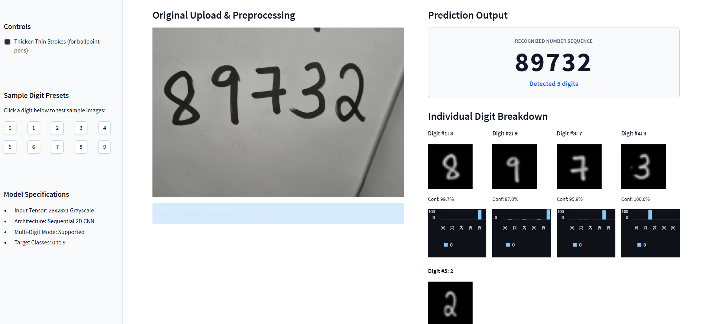
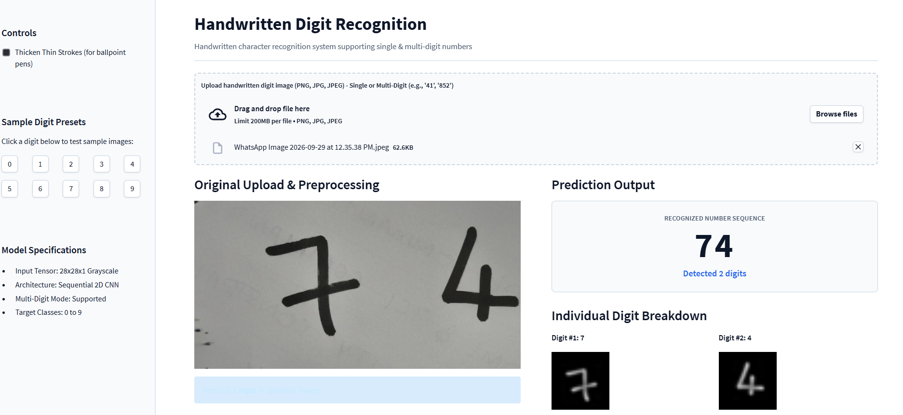
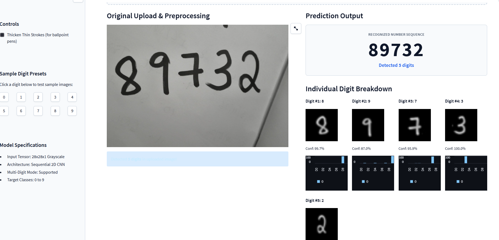

# Handwritten Digit Recognition using CNN

A deep learning project that recognizes handwritten digits (0–9) using a Convolutional Neural Network (CNN) trained on the MNIST dataset.

## Features

- CNN-based handwritten digit classification
- 99%+ accuracy on the MNIST test dataset
- Real-world handwritten image preprocessing
- Multi-digit recognition
- Individual digit prediction with confidence scores
- Streamlit web application

## Tech Stack

Python • TensorFlow/Keras • NumPy • Pandas • Streamlit

## Applications

- Banking and cheque processing
- Handwritten form digitization
- Postal and PIN code recognition
- Numerical data entry automation
- Document processing
- Educational applications

## Demo

### Application Output 1



### Application Output 2



### Application Output 3



## Project Structure

```text
Handwritten-Digit-Recognition/
│
├── app/
│   └── app.py
│
├── models/
│   └── handwritten_digit_cnn.keras
│
├── notebooks/
│   └── Handwritten_Character_Recognition.ipynb
│
├── outputs/
│   ├── plots/
│   └── results/
│
├── src/
│   ├── train.py
│   ├── evaluate.py
│   └── predict.py
│
├── Screenshots/
│   ├── img1.png
│   ├── img2.png
│   └── img3.png
│
├── README.md
└── requirements.txt
